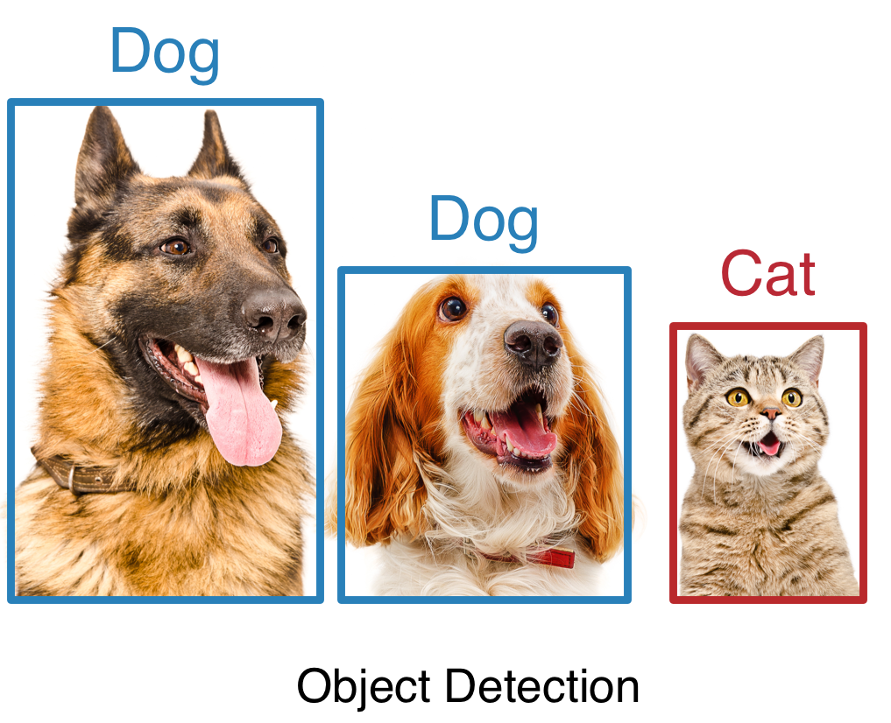
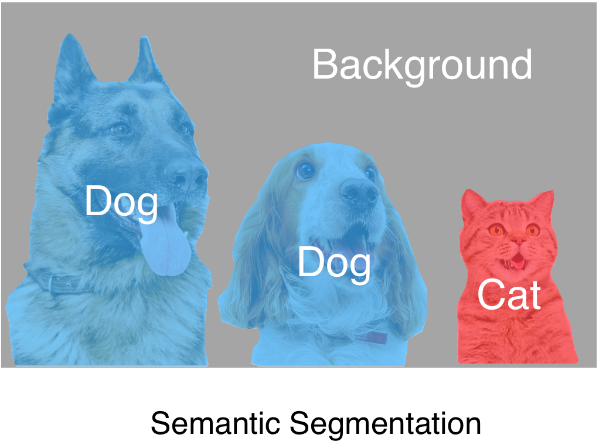
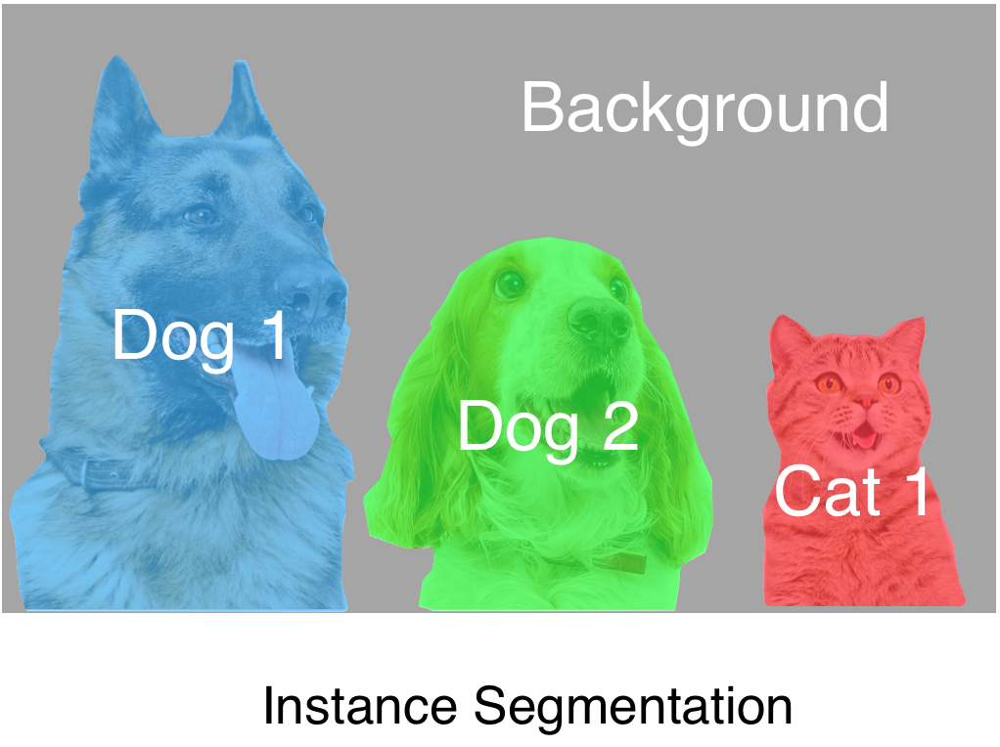
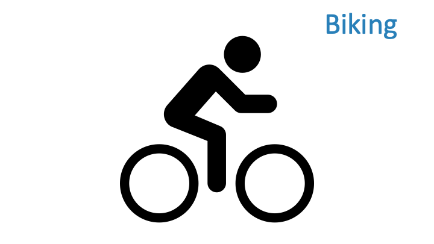
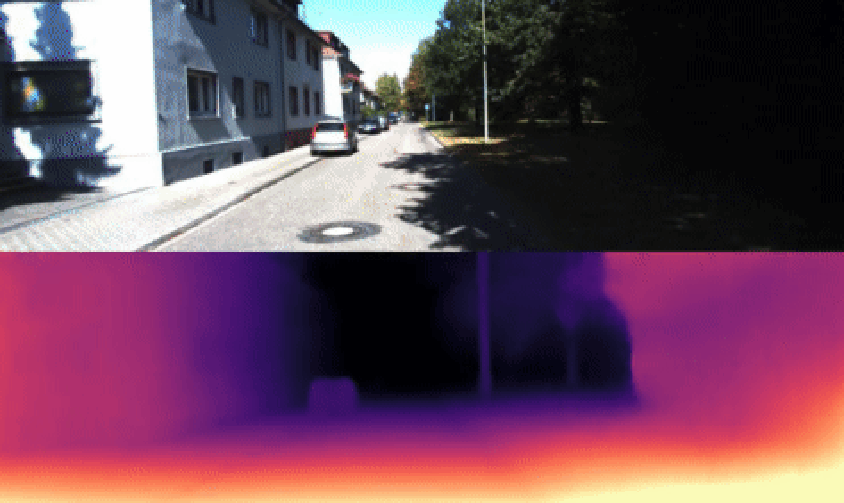

# Gluon CV Toolkit


[](./LICENSE)
[](https://pypi.python.org/pypi/gluoncv)
[](https://pypi.org/project/gluoncv/#history)
[](http://pepy.tech/project/gluoncv)

[](https://paperswithcode.com/sota/semantic-segmentation-on-ade20k?p=resnest-split-attention-networks)
[](https://paperswithcode.com/sota/object-detection-on-coco?p=resnest-split-attention-networks)
[](https://paperswithcode.com/sota/instance-segmentation-on-coco?p=resnest-split-attention-networks)
[](https://paperswithcode.com/sota/panoptic-segmentation-on-coco-panoptic?p=resnest-split-attention-networks)
[](https://paperswithcode.com/sota/image-classification-on-imagenet?p=resnest-split-attention-networks)

| [Installation](https://gluon-cv.mxnet.io/install.html) | [Documentation](https://gluon-cv.mxnet.io) | [Tutorials](https://gluon-cv.mxnet.io/tutorials/index.html) |

GluonCV provides implementations of the state-of-the-art (SOTA) deep learning models in computer vision.

It is designed for engineers, researchers, and
students to fast prototype products and research ideas based on these
models. This toolkit offers four main features:

1. Training scripts to reproduce SOTA results reported in research papers
2. Supports both PyTorch and MXNet
3. A large number of pre-trained models
4. Carefully designed APIs that greatly reduce the implementation complexity
5. Community supports

# Demo

<div align="center">
    
</div>

<br>

Check the HD video at [Youtube](https://www.youtube.com/watch?v=nfpouVAzXt0) or [Bilibili](https://www.bilibili.com/video/av55619231).


# Supported Applications

| Application  | Illustration  | Available Models |
|:-----------------------:|:---:|:---:|
| [Image Classification:](https://gluon-cv.mxnet.io/model_zoo/classification.html) <br/>recognize an object in an image.  | <a href="https://gluon-cv.mxnet.io/model_zoo/classification.html"></a>  | 50+ models, including <br/><a href="https://gluon-cv.mxnet.io/model_zoo/classification.html#resnet">ResNet</a>, <a href="https://gluon-cv.mxnet.io/model_zoo/classification.html#mobilenet">MobileNet</a>, <br/><a href="https://gluon-cv.mxnet.io/model_zoo/classification.html#densenet">DenseNet</a>, <a href="https://gluon-cv.mxnet.io/model_zoo/classification.html#vgg">VGG</a>, ... |
| [Object Detection:](https://gluon-cv.mxnet.io/model_zoo/detection.html) <br/>detect multiple objects with their <br/> bounding boxes in an image.     |  <a href="https://gluon-cv.mxnet.io/model_zoo/detection.html"></a> | <a href="https://gluon-cv.mxnet.io/model_zoo/detection.html#faster-rcnn">Faster RCNN</a>, <a href="https://gluon-cv.mxnet.io/model_zoo/detection.html#ssd">SSD</a>, <a href="https://gluon-cv.mxnet.io/model_zoo/detection.html#yolo-v3">Yolo-v3</a> |
| [Semantic Segmentation:](https://gluon-cv.mxnet.io/model_zoo/segmentation.html#semantic-segmentation) <br/>associate each pixel of an image <br/> with a categorical label. |  <a href="https://gluon-cv.mxnet.io/model_zoo/segmentation.html#semantic-segmentation"></a> | <a href="https://gluon-cv.mxnet.io/model_zoo/segmentation.html#semantic-segmentation">FCN</a>, <a href="https://gluon-cv.mxnet.io/model_zoo/segmentation.html#semantic-segmentation">PSP</a>, <a href="https://gluon-cv.mxnet.io/model_zoo/segmentation.html#semantic-segmentation">ICNet</a>, <a href="https://gluon-cv.mxnet.io/model_zoo/segmentation.html#semantic-segmentation">DeepLab-v3</a>, <a href="https://gluon-cv.mxnet.io/model_zoo/segmentation.html#semantic-segmentation">DeepLab-v3+</a>, <a href="https://gluon-cv.mxnet.io/model_zoo/segmentation.html#semantic-segmentation">DANet</a>, <a href="https://gluon-cv.mxnet.io/model_zoo/segmentation.html#semantic-segmentation">FastSCNN</a> |
| [Instance Segmentation:](https://gluon-cv.mxnet.io/model_zoo/segmentation.html#instance-segmentation) <br/>detect objects and associate <br/> each pixel inside object area with an <br/> instance label. | <a href="https://gluon-cv.mxnet.io/model_zoo/segmentation.html#instance-segmentation"></a> | <a href="https://gluon-cv.mxnet.io/model_zoo/segmentation.html#instance-segmentation">Mask RCNN</a>|
| [Pose Estimation:](https://gluon-cv.mxnet.io/model_zoo/pose.html) <br/>detect human pose <br/> from images. | <a href="https://gluon-cv.mxnet.io/model_zoo/pose.html"></a> | <a href="https://gluon-cv.mxnet.io/model_zoo/pose.html#simple-pose-with-resnet">Simple Pose</a>|
| [Video Action Recognition:](https://gluon-cv.mxnet.io/model_zoo/action_recognition.html) <br/>recognize human actions <br/> in a video. | <a href="https://gluon-cv.mxnet.io/model_zoo/action_recognition.html"></a> | MXNet: <a href="https://gluon-cv.mxnet.io/model_zoo/action_recognition.html">TSN</a>, <a href="https://gluon-cv.mxnet.io/model_zoo/action_recognition.html">C3D</a>, <a href="https://gluon-cv.mxnet.io/model_zoo/action_recognition.html">I3D</a>, <a href="https://gluon-cv.mxnet.io/model_zoo/action_recognition.html">I3D_slow</a>, <a href="https://gluon-cv.mxnet.io/model_zoo/action_recognition.html">P3D</a>, <a href="https://gluon-cv.mxnet.io/model_zoo/action_recognition.html">R3D</a>, <a href="https://gluon-cv.mxnet.io/model_zoo/action_recognition.html">R2+1D</a>, <a href="https://gluon-cv.mxnet.io/model_zoo/action_recognition.html">Non-local</a>, <a href="https://gluon-cv.mxnet.io/model_zoo/action_recognition.html">SlowFast</a> <br/> PyTorch: <a href="https://gluon-cv.mxnet.io/model_zoo/action_recognition.html">TSN</a>, <a href="https://gluon-cv.mxnet.io/model_zoo/action_recognition.html">I3D</a>, <a href="https://gluon-cv.mxnet.io/model_zoo/action_recognition.html">I3D_slow</a>, <a href="https://gluon-cv.mxnet.io/model_zoo/action_recognition.html">R2+1D</a>, <a href="https://gluon-cv.mxnet.io/model_zoo/action_recognition.html">Non-local</a>, <a href="https://gluon-cv.mxnet.io/model_zoo/action_recognition.html">CSN</a>, <a href="https://gluon-cv.mxnet.io/model_zoo/action_recognition.html">SlowFast</a>, <a href="https://gluon-cv.mxnet.io/model_zoo/action_recognition.html">TPN</a> |
| [Depth Prediction:](https://gluon-cv.mxnet.io/model_zoo/depth.html) <br/>predict depth map <br/> from images. | <a href="https://gluon-cv.mxnet.io/model_zoo/depth.html"></a> | <a href="https://gluon-cv.mxnet.io/model_zoo/depth.html#kitti-dataset">Monodepth2</a>|
| [GAN:](https://github.com/dmlc/gluon-cv/tree/master/scripts/gan) <br/>generate visually deceptive images | <a href="https://github.com/dmlc/gluon-cv/tree/master/scripts/gan"></a> | <a href="https://github.com/dmlc/gluon-cv/tree/master/scripts/gan/wgan">WGAN</a>, <a href="https://github.com/dmlc/gluon-cv/tree/master/scripts/gan/cycle_gan">CycleGAN</a>, <a href="https://github.com/dmlc/gluon-cv/tree/master/scripts/gan/stylegan">StyleGAN</a>|
| [Person Re-ID:](https://github.com/dmlc/gluon-cv/tree/master/scripts/re-id/baseline) <br/>re-identify pedestrians across scenes | <a href="https://github.com/dmlc/gluon-cv/tree/master/scripts/re-id/baseline"></a> |<a href="https://github.com/dmlc/gluon-cv/tree/master/scripts/re-id/baseline">Market1501 baseline</a> |

# Installation

GluonCV is built on top of MXNet and PyTorch. Depending on the individual model implementation(check [model zoo](https://gluon-cv.mxnet.io/model_zoo/index.html) for the complete list), you will need to install either one of the deep learning framework. Of course you can always install both for the best coverage.

Please also check [installation guide](https://cv.gluon.ai/install.html) for a comprehensive guide to help you choose the right installation command for your environment.

## Installation (MXNet)

GluonCV supports Python 3.6 or later. The easiest way to install is via pip.

### Stable Release
The following commands install the stable version of GluonCV and MXNet:

```bash
pip install gluoncv --upgrade
# native
pip install -U --pre mxnet -f https://dist.mxnet.io/python/mkl
# cuda 10.2
pip install -U --pre mxnet -f https://dist.mxnet.io/python/cu102mkl
```

**The latest stable version of GluonCV is 0.8 and we recommend mxnet 1.6.0/1.7.0**

### Nightly Release

You may get access to latest features and bug fixes with the following commands which install the nightly build of GluonCV and MXNet:

```bash
pip install gluoncv --pre --upgrade
# native
pip install -U --pre mxnet -f https://dist.mxnet.io/python/mkl
# cuda 10.2
pip install -U --pre mxnet -f https://dist.mxnet.io/python/cu102mkl
```

There are multiple versions of MXNet pre-built package available. Please refer to [mxnet packages](https://gluon-crash-course.mxnet.io/mxnet_packages.html) if you need more details about MXNet versions.


## Installation (PyTorch)

GluonCV supports Python 3.6 or later. The easiest way to install is via pip.

### Stable Release
The following commands install the stable version of GluonCV and PyTorch:

```bash
pip install gluoncv --upgrade
# native
pip install torch==1.6.0+cpu torchvision==0.7.0+cpu -f https://download.pytorch.org/whl/torch_stable.html
# cuda 10.2
pip install torch==1.6.0 torchvision==0.7.0
```
There are multiple versions of PyTorch pre-built package available. Please refer to [PyTorch](https://pytorch.org/get-started/previous-versions/) if you need other versions.


**The latest stable version of GluonCV is 0.8 and we recommend PyTorch 1.6.0**

### Nightly Release

You may get access to latest features and bug fixes with the following commands which install the nightly build of GluonCV:

```bash
pip install gluoncv --pre --upgrade
# native
pip install --pre torch torchvision torchaudio -f https://download.pytorch.org/whl/nightly/cpu/torch_nightly.html
# cuda 10.2
pip install --pre torch torchvision torchaudio -f https://download.pytorch.org/whl/nightly/cu102/torch_nightly.html
```


# Docs 📖
GluonCV documentation is available at [our website](https://gluon-cv.mxnet.io/index.html).

# Examples

All tutorials are available at [our website](https://gluon-cv.mxnet.io/index.html)!

- [Image Classification](http://gluon-cv.mxnet.io/build/examples_classification/index.html)

- [Object Detection](http://gluon-cv.mxnet.io/build/examples_detection/index.html)

- [Semantic Segmentation](http://gluon-cv.mxnet.io/build/examples_segmentation/index.html)

- [Instance Segmentation](http://gluon-cv.mxnet.io/build/examples_instance/index.html)

- [Video Action Recognition](https://gluon-cv.mxnet.io/build/examples_action_recognition/index.html)

- [Depth Prediction](https://gluon-cv.mxnet.io/build/examples_depth/index.html)

- [Generative Adversarial Network](https://github.com/dmlc/gluon-cv/tree/master/scripts/gan)

- [Person Re-identification](https://github.com/dmlc/gluon-cv/tree/master/scripts/re-id/)

# Resources

Check out how to use GluonCV for your own research or projects.

- For background knowledge of deep learning or CV, please refer to the open source book [*Dive into Deep Learning*](http://d2l.ai/). If you are new to Gluon, please check out [our 60-minute crash course](http://gluon-crash-course.mxnet.io/).
- For getting started quickly, refer to notebook runnable examples at [Examples](https://gluon-cv.mxnet.io/build/examples_classification/index.html).
- For advanced examples, check out our [Scripts](http://gluon-cv.mxnet.io/master/scripts/index.html).
- For experienced users, check out our [API Notes](https://gluon-cv.mxnet.io/api/data.datasets.html#).

# Citation

If you feel our code or models helps in your research, kindly cite our papers:

```
@article{gluoncvnlp2020,
  author  = {Jian Guo and He He and Tong He and Leonard Lausen and Mu Li and Haibin Lin and Xingjian Shi and Chenguang Wang and Junyuan Xie and Sheng Zha and Aston Zhang and Hang Zhang and Zhi Zhang and Zhongyue Zhang and Shuai Zheng and Yi Zhu},
  title   = {GluonCV and GluonNLP: Deep Learning in Computer Vision and Natural Language Processing},
  journal = {Journal of Machine Learning Research},
  year    = {2020},
  volume  = {21},
  number  = {23},
  pages   = {1-7},
  url     = {http://jmlr.org/papers/v21/19-429.html}
}

@article{he2018bag,
  title={Bag of Tricks for Image Classification with Convolutional Neural Networks},
  author={He, Tong and Zhang, Zhi and Zhang, Hang and Zhang, Zhongyue and Xie, Junyuan and Li, Mu},
  journal={arXiv preprint arXiv:1812.01187},
  year={2018}
}

@article{zhang2019bag,
  title={Bag of Freebies for Training Object Detection Neural Networks},
  author={Zhang, Zhi and He, Tong and Zhang, Hang and Zhang, Zhongyue and Xie, Junyuan and Li, Mu},
  journal={arXiv preprint arXiv:1902.04103},
  year={2019}
}

@article{zhang2020resnest,
  title={ResNeSt: Split-Attention Networks},
  author={Zhang, Hang and Wu, Chongruo and Zhang, Zhongyue and Zhu, Yi and Zhang, Zhi and Lin, Haibin and Sun, Yue and He, Tong and Muller, Jonas and Manmatha, R. and Li, Mu and Smola, Alexander},
  journal={arXiv preprint arXiv:2004.08955},
  year={2020}
}
```
