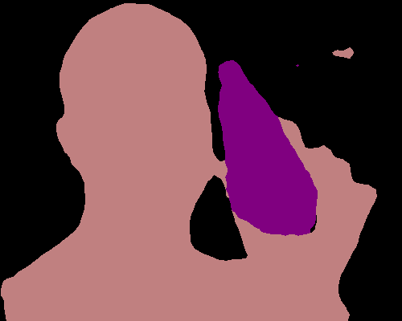
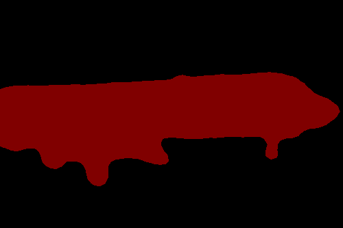
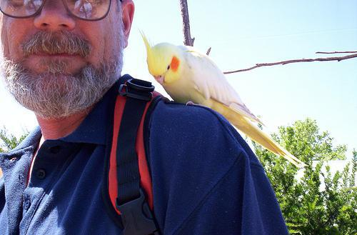
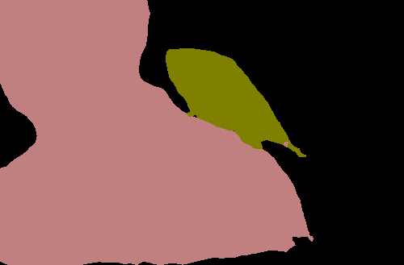
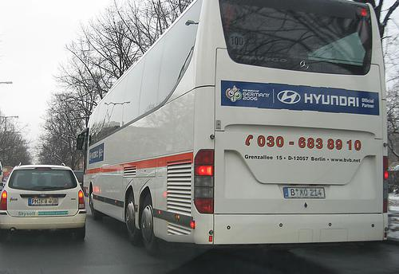

Semantic Segmentation Tutorial
==============================

Tutorial and Examples
_____________________

This is a semantic segmentation tutorial using Gluon Vison, a step-by-step example.
The readers should have basic knowledge of deep learning and should be familiar with Gluon API.
New users may first go through Gluon tutorials
`Deep Learning - The Straight Dope <http://gluon.mxnet.io/>`_.

Fully Convolutional Network
---------------------------

.. image:: https://cdn-images-1.medium.com/max/800/1*wRkj6lsQ5ckExB5BoYkrZg.png
    :width: 70%
    :align: center

(figure redit to `Long et al. <https://arxiv.org/pdf/1411.4038.pdf>`_ )

State-of-the-art approaches of semantic segmentation are typically based on
Fully Convolutional Network (FCN) [Long15]_ .
The key idea of a fully convolutional network is that it is "fully convolutional",
which means it does have any fully connected layers. Therefore, the network can
accept arbitrary input size and make dense per-pixel predictions.
Base/Encoder network is typically pre-trained on ImageNet, because the features
learned from diverse set of images contain rich contextual information, which
can be beneficial for semantic segmentation.

Model Dilation
~~~~~~~~~~~~~~

The adaption of base network pre-trained on ImageNet leads to loss spatial resolution,
because these networks are originally designed for classification task.
Following recent works in semantic segmentation, we apply dilation strategy to the
stage 3 and stage 4 of the pre-trained networks, which produces stride of 8
featuremaps (models are provided in :class:`gluonvision.model_zoo.Dilated_ResNetV2`).
Visualization of dilated/atrous convoution:

.. image:: https://raw.githubusercontent.com/vdumoulin/conv_arithmetic/master/gif/dilation.gif
    :width: 40%
    :align: center

(figure credit to `conv_arithmetic <https://github.com/vdumoulin/conv_arithmetic>`_ )

For example, loading a dilated ResNet50 is simply::

    pretrained_net = gluonvision.model_zoo.dilated_resnet50(pretrained=True)

For convenience, we provide a base model for semantic segmentation, which automatically
load the pre-trained dilated ResNet :class:`gluonvision.model_zoo.SegBaseModel`, which can
be easily inherited and used.

FCN Block
~~~~~~~~~

We build a fully convolutional "head" on top of the basenetwork (FCN model is provided
in :class:`gluonvision.model_zoo.FCN`)::

    class _FCNHead(HybridBlock):
        def __init__(self, nclass, norm_layer):
            super(_FCNHead, self).__init__()
            with self.name_scope():
                self.block = nn.HybridSequential(prefix='')
                self.block.add(norm_layer(in_channels=2048))
                self.block.add(nn.Activation('relu'))
                self.block.add(nn.Conv2D(in_channels=2048, channels=512,
                                         kernel_size=3, padding=1))
                self.block.add(norm_layer(in_channels=512))
                self.block.add(nn.Activation('relu'))
                self.block.add(nn.Dropout(0.1))
                self.block.add(nn.Conv2D(in_channels=512, channels=nclass,
                                         kernel_size=1))

        def hybrid_forward(self, F, x):
            return self.block(x)

    class FCN(SegBaseModel):
        def __init__(self, nclass, backbone='resnet50', norm_layer=nn.BatchNorm):
            super(FCN, self).__init__(backbone, norm_layer)
            self._prefix = ''
            with self.name_scope():
                self.head = _FCNHead(nclass, norm_layer=norm_layer)
            self.head.initialize(init=init.Xavier())

        def forward(self, x):
            _, _, H, W = x.shape
            x = self.pretrained(x)
            x = self.head(x)
            x = F.contrib.BilinearResize2D(x, height=H, width=W)
            return x

Dataset and Data Augmentation
-----------------------------

We provide semantic segmentation datasets in :class:`gluonvision.data`.
For example, we can easily get the Pascal VOC 2012 dataset::

    train_set = gluonvision.data.VOCSegmentationDataset(root)

We follow the standard data augmentation routine to transform the input image
and the ground truth label map synchronously. (Note that "nearest"
mode upsample are applied to the label maps to avoid messing up the boundaries.)
We first randomly scale the input image from 0.5 to 2.0 times, then rotate
the image from -10 to 10 degrees, and crop the image with padding if needed.

.. todo::

    add a gif showing the autmentation

Test Pre-trained Model
~~~~~~~~~~~~~~~~~~~~~~

.. code-block:: python

    # load pre-trained model
    model = FCN(nclass=22, backbone='resnet101')
    model.load_params('fcn101.params')
    model.collect_params().reset_ctx(ctx)

    # read image and normalize the data
    transform = Compose([
        ToTensor(ctx=ctx),
        Normalize(mean=[.485, .456, .406], std=[.229, .224, .225], ctx=ctx)])

    def load_image(path, transform, ctx):
        image = Image.open(path).convert('RGB')
        image = transform(image)
        image = image.expand_dims(0).as_in_context(ctx)
        return image

    image = load_image('example.jpg', transform, ctx)

    # make prediction using single scale
    output = model(image)
    predict = F.squeeze(F.argmax(output, 1)).asnumpy()

    # add color pallete for visualization
    mask = get_mask(predict, 'pascal_voc')
    mask.save('output.png')

Please see the demo.py for more evaluation options.

.. image:: ../../scripts/segmentation/examples/6.png
    :width: 45%

Benchmarks and Training
_______________________

- Checkout the training scripts for reproducing the experiments, and see the detail running 
instructions in the `README <https://github.com/dmlc/gluon-vision/tree/master/scripts/segmentation>`_ .

- Table of pre-trained models and its performance (models :math:`^\ast` denotes pre-trained on COCO):

.. role:: raw-html(raw)
   :format: html

.. _Table:

    +------------------------+------------+-----------+-----------+-----------+-----------+----------------------------------------------------------------------------------------------+
    | Method                 | Backbone   | Dataset   | Note      | pixAcc    | mIoU      | Training Scripts                                                                             |
    +========================+============+===========+===========+===========+===========+==============================================================================================+
    | FCN                    | ResNet50   | PASCAL12  | stride 8  | N/A       | 70.9_     | :raw-html:`<a href="javascript:toggleblock('cmd_fcn_50')" class="toggleblock">cmd</a>`       |
    +------------------------+------------+-----------+-----------+-----------+-----------+----------------------------------------------------------------------------------------------+
    | FCN                    | ResNet101  | PASCAL12  | stride 8  | N/A       |           | :raw-html:`<a href="javascript:toggleblock('cmd_fcn_101')" class="toggleblock">cmd</a>`      |
    +------------------------+------------+-----------+-----------+-----------+-----------+----------------------------------------------------------------------------------------------+

    .. _70.9:  http://host.robots.ox.ac.uk:8080/anonymous/FR9APO.html

.. raw:: html

    <code xml:space="preserve" id="cmd_fcn_50" style="display: none; text-align: left; white-space: pre-wrap">
    # First training on augmented set
    CUDA_VISIBLE_DEVICES=0,1,2,3 python main.py --dataset pascal_aug --model fcn --backbone resnet50 --lr 0.001 --syncbn --checkname mycheckpoint
    # Finetuning on original set
    CUDA_VISIBLE_DEVICES=0,1,2,3 python main.py --dataset pascal_voc --model fcn --backbone resnet50 --lr 0.0001 --syncbn --checkname mycheckpoint --resume runs/pascal_aug/fcn/mycheckpoint/checkpoint.params
    </code>

    <code xml:space="preserve" id="cmd_fcn_101" style="display: none; text-align: left; white-space: pre-wrap">
    # First training on augmented set
    CUDA_VISIBLE_DEVICES=0,1,2,3 python main.py --dataset pascal_aug --model fcn --backbone resnet101 --lr 0.001 --syncbn --checkname mycheckpoint
    # Finetuning on original set
    CUDA_VISIBLE_DEVICES=0,1,2,3 python main.py --dataset pascal_voc --model fcn --backbone resnet101 --lr 0.0001 --syncbn --checkname mycheckpoint --resume runs/pascal_aug/fcn/mycheckpoint/checkpoint.params
    </code>

    <code xml:space="preserve" id="cmd_psp_50" style="display: none; text-align: left; white-space: pre-wrap">
    # First training on augmented set
    CUDA_VISIBLE_DEVICES=0,1,2,3 python main.py --dataset pascal_aug --model pspnet --backbone resnet50 --lr 0.001 --syncbn --checkname mycheckpoint
    # Finetuning on original set
    CUDA_VISIBLE_DEVICES=0,1,2,3 python main.py --dataset pascal_voc --model pspnet --backbone resnet50 --lr 0.0001 --syncbn --checkname mycheckpoint --resume runs/pascal_aug/fcn/mycheckpoint/checkpoint.params
    </code>

    <code xml:space="preserve" id="cmd_psp_101" style="display: none; text-align: left; white-space: pre-wrap">
    # First training on augmented set
    CUDA_VISIBLE_DEVICES=0,1,2,3 python main.py --dataset pascal_aug --model pspnet --backbone resnet101 --lr 0.001 --syncbn --checkname mycheckpoint
    # Finetuning on original set
    CUDA_VISIBLE_DEVICES=0,1,2,3 python main.py --dataset pascal_voc --model pspnet --backbone resnet101 --lr 0.0001 --syncbn --checkname mycheckpoint --resume runs/pascal_aug/fcn/mycheckpoint/checkpoint.params
    </code>

    <code xml:space="preserve" id="cmd_psp_101_coco" style="display: none; text-align: left; white-space: pre-wrap">
    # Pre-training on COCO dataset
    CUDA_VISIBLE_DEVICES=0,1,2,3 python main.py --dataset mscoco --model pspnet --backbone resnet101 --lr 0.01 --syncbn --checkname mycheckpoint
    # Training on augmented set
    CUDA_VISIBLE_DEVICES=0,1,2,3 python main.py --dataset pascal_aug --model pspnet --backbone resnet101 --lr 0.001 --syncbn --checkname mycheckpoint
    # Finetuning on original set
    CUDA_VISIBLE_DEVICES=0,1,2,3 python main.py --dataset pascal_voc --model pspnet --backbone resnet101 --lr 0.0001 --syncbn --checkname mycheckpoint --resume runs/pascal_aug/fcn/mycheckpoint/checkpoint.params
    </code>

References
----------

.. [Long15] Long, Jonathan, Evan Shelhamer, and Trevor Darrell. \
    "Fully convolutional networks for semantic segmentation." \
    Proceedings of the IEEE conference on computer vision and pattern recognition. 2015.
