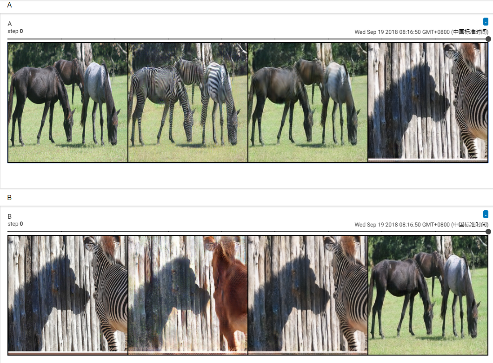

## Reproducing Cycle GAN experiments


**Download horse2zebra dataset**
```bash
python ./download_dataset.py --download-dir . --file horse2zebra
```

**Monitoring loss values and images during training**
```bash
pip install mxboard
tensorboard --logdir=./logs --host=127.0.0.1 --port=8888
```
Details about mxboard is in [mxboard](https://github.com/awslabs/mxboard)

**Train Cycle GAN**
```bash
python train_cgan.py --dataroot ./horse2zebra
```

**Test Cycle GAN**

for horse to zebra model:
```bash
python demo_cycle_gan.py --images ./horse2zebra/testA/n02391049_10160.jpg --pretrained ./samples/netG_A_epoch_200.params --gpu_id -1
```
for zebra to horse model:
```bash
python demo_cycle_gan.py --images ./horse2zebra/testA/n02391049_10160.jpg --pretrained ./samples/netG_A_epoch_200.params --gpu_id -1
```



The meaning of those images are :

| | | | |
|-|-|-|-|
| real_A(from dataset) | fake_B(generate from real_A) | rec_A(reconstruct from fake_B) | idt_A(generate from real_B) |
| real_B(from dataset) | fake_A(generate from real_A) | rec_B(reconstruct from fake_A) | idt_B(generate from real_A) |

## References
["Cycle GAN"](https://arxiv.org/abs/1703.10593)
