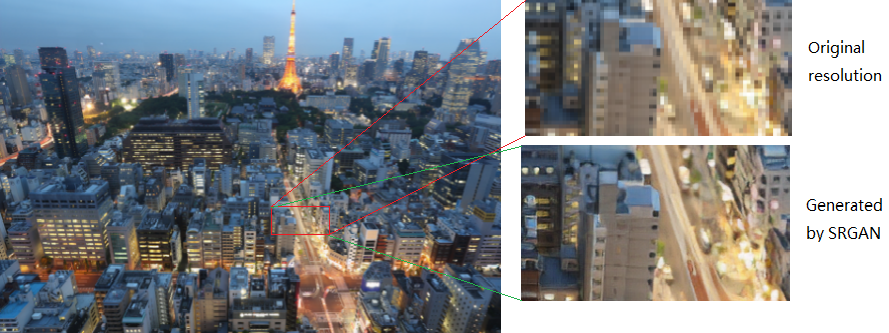
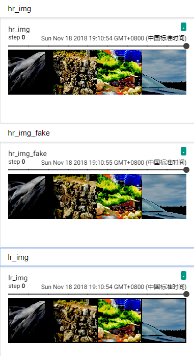

## Reproducing SRGAN experiments



**Download DIV2K dataset**
```bash
python download_dataset.py --file DIV2K_train_HR
```

**Train SRGAN**
```bash
python train_srgan.py --dataroot ./DIV2K_train_HR
```

**Monitoring loss values and images during training**
```bash
pip install mxboard
tensorboard --logdir=./logs --host=127.0.0.1 --port=8888
```
Details about mxboard is in [mxboard](https://github.com/awslabs/mxboard)



**Test SRGAN**

```bash
python demo_sr_gan.py --images ./ --pretrained ./samples/netG_epoch_20000.params --gpu_id -1
```

## References
["Photo-Realistic Single Image Super-Resolution Using a Generative Adversarial Network
"](https://arxiv.org/abs/1609.04802)