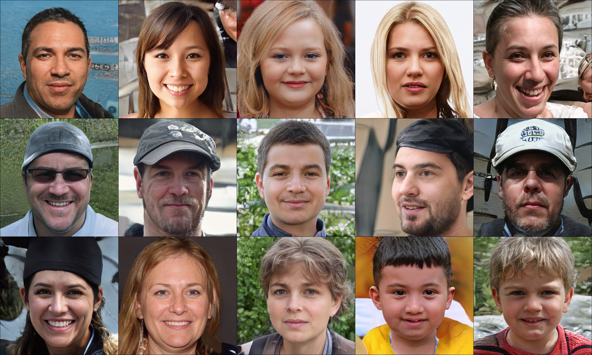

## StyleGAN

**Train StyleGAN**

Instructions coming soon.

**Test StyleGAN**

Test the converted pretrained weights on [Flickr-Faces-HQ Dataset (FFHQ)](https://github.com/NVlabs/ffhq-dataset). The converted pretrained model "stylegan-ffhq-1024px-new.params" can be downloaded from [Google Drive](https://drive.google.com/file/d/1dYWAT9L3r2jmGe741AiSSAxg1su3ODvj/view?usp=sharing).

```bash
python demo_stylegan.py --path ./stylegan-ffhq-1024px-new.params --gpu_id -1
```

**Generated images from the converted pretrained FFHQ weight**



## References
[A Style-Based Generator Architecture for Generative Adversarial Networks, CVPR 2019](https://arxiv.org/abs/1812.04948)