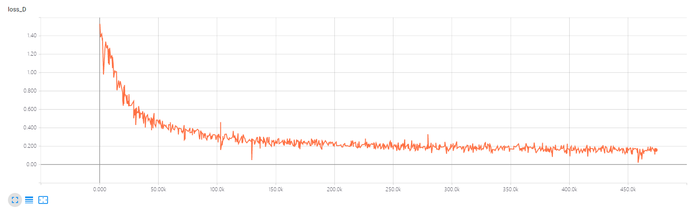

## Reproducing LSUN experiments


**Download LSUN dataset**
```bash
cd ../../../scripts/datasets/
python lsun.py -c bedroom
```

**Monitoring -loss D values during training**
```bash
pip install mxboard
tensorboard --logdir=./logs --host=127.0.0.1 --port=8888
```
Details about mxboard is in [mxboard](https://github.com/awslabs/mxboard)


**With DCGAN:**

```bash
python train_wgan.py --dataset lsun --dataroot [lsun-train-folder] --cuda
```

**With MLP:**

```bash
python main.py --mlp_G --ngf 512
```

**Generate fake samples after 400000 epoch**


**Plot the value `-Loss_D`**



## References
["Wasserstein GAN"](https://arxiv.org/abs/1701.07875)
